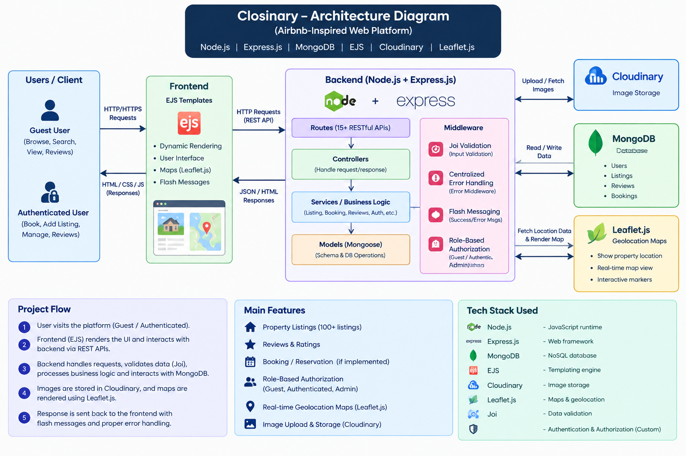

# Closinary



A lightweight, server-rendered web application template built with Node.js and EJS. Closinary is designed as a starter for apps that manage and display collections (e.g., wardrobe, product catalog, portfolio) and includes server-side rendering, file/image uploads, and a simple modular architecture. The included architecture diagram (Architecture_Closinary.png) shows the high-level components and how they interact.

## Table of contents
- [About](#about)
- [Architecture](#architecture)
- [Features](#features)
- [Tech stack](#tech-stack)
- [Getting started](#getting-started)
- [Environment variables](#environment-variables)
- [Project structure](#project-structure)
- [Usage](#usage)
- [Testing](#testing)
- [Deployment](#deployment)
- [Contributing](#contributing)
- [License](#license)
- [Author](#author)

## About
Closinary is a server-rendered web application scaffold that uses Express + EJS for views and a modular folder structure to keep routes, controllers, views, and static assets separated. It’s ideal as a starting point for catalog-style apps where server-side rendering and SEO-friendly pages are important.

## Architecture
Refer to Architecture_Closinary.png at the repository root for the diagram.

High-level components shown in the diagram:
- Client (browser) — requests pages, submits forms, uploads images.
- Web Server — Node.js + Express handles routing, business logic, and server-side rendering with EJS.
- Views — EJS templates render HTML on the server.
- Database — persistence layer for users, items, and metadata (e.g., MongoDB or another DB; configure in env).
- Media Storage — external image/file hosting (e.g., Cloudinary or S3) for uploaded assets.
- Optional Auth / Session store — session management and user authentication.

This architecture keeps the UI simple (EJS + CSS) while enabling scalable media hosting and API endpoints for richer interactions.

## Features
- Server-side rendered pages with EJS templates
- Modular Express routing and controllers
- Image upload support (designed to integrate with Cloudinary/S3)
- Simple authentication-ready structure (configurable)
- Clear separation of views, static assets, and API logic
- Ready for deployment to common Node hosting platforms

## Tech stack
- Node.js
- Express
- EJS (server-side templates)
- CSS (and optional UI frameworks like Bootstrap or Tailwind)
- Cloud media storage (Cloudinary / AWS S3) — optional, recommended for production
- Database (e.g., MongoDB, PostgreSQL) — configurable via env

## Getting started

1. Clone the repo
   ```bash
   git clone https://github.com/Krish-Gupta123/Closinary.git
   cd Closinary
   ```

2. Install dependencies
   ```bash
   npm install
   ```

3. Create a copy of the example environment file
   ```bash
   cp .env.example .env
   ```
   (Edit .env with your configuration — see the Environment variables section.)

4. Run locally
   - Development (with nodemon if present):
     ```bash
     npm run dev
     ```
   - Production:
     ```bash
     npm start
     ```

5. Open http://localhost:3000 (or your configured PORT)

## Environment variables
Create a .env file in the project root. Typical variables the project expects:

```
PORT=3000
NODE_ENV=development
DATABASE_URL=<your-database-connection-string>
SESSION_SECRET=<a-secure-random-secret>
CLOUDINARY_CLOUD_NAME=<cloud_name>         # optional, if using Cloudinary
CLOUDINARY_API_KEY=<api_key>               # optional
CLOUDINARY_API_SECRET=<api_secret>         # optional
```

Note: Replace variable names with the ones actually referenced by the app (check config files).

## Project structure (suggested)
- /public — static assets (CSS, images, client JS)
- /views — EJS templates
- /routes — Express route definitions
- /controllers — request handlers / business logic
- /models — data models (DB schemas)
- /config — configuration and third-party integrations
- /uploads — local uploads (for development only)
- server.js / app.js — application entrypoint

Adjust this section to match the exact layout in your repo if it differs.

## Usage / Common routes
(Modify according to your app's actual route names.)
- GET / — Home / landing page
- GET /items — Browse items
- GET /items/:id — View item details
- GET /items/new — Create new item form
- POST /items — Submit new item (with image upload)
- GET /auth/login — Login page
- POST /auth/login — Authenticate
- GET /dashboard — User dashboard (protected)

## Image uploads
The project is designed to offload images to an external service (Cloudinary or S3). In development you can store uploads locally, but for production we recommend configuring Cloudinary (see env variables above). The architecture diagram shows image upload flow: client → server → Cloudinary (or storage) → CDN.

## Testing
If tests exist in the repo, run:
```bash
npm test
```

Add unit/integration tests to controllers, routes, and any utility modules. Consider using Jest or Mocha + Chai for JavaScript tests.

## Deployment
General steps for deploying to a platform like Heroku, Render, or a VPS:

1. Set NODE_ENV=production and configure DATABASE_URL and session secrets.
2. Configure environment variables in your host’s dashboard.
3. Ensure you have a production build step if required and that static assets are served correctly.
4. Configure a managed file store (Cloudinary/S3) for media in production.

For platforms that use Docker or containers, add a Dockerfile and follow provider-specific deployment guidelines.

## Contributing
Contributions are welcome:

1. Fork the repo
2. Create a feature branch: git checkout -b feature/awesome
3. Commit your changes: git commit -m "Add awesome feature"
4. Push to your branch and open a Pull Request

Please open issues for bugs or feature requests and include steps to reproduce.

## License
This project is provided under the MIT License. See LICENSE file for details (or add one if not present).

## Author
Krish R Gupta — krish (profile: https://github.com/Krish-Gupta123)

---

If you'd like, I can:
- Commit additional changes (add LICENSE, .env.example, or CI) — tell me which files to add,
- Or inspect your code and tailor this README to the exact scripts, routes, and DB used. 
